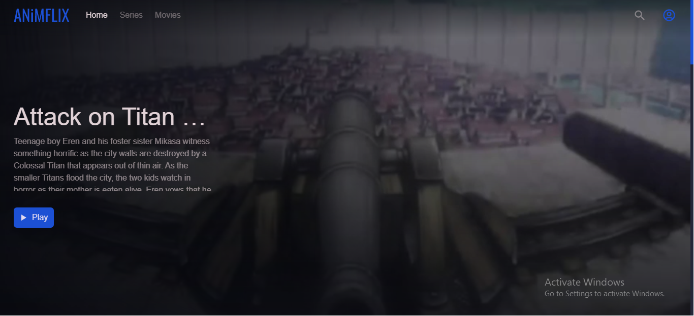
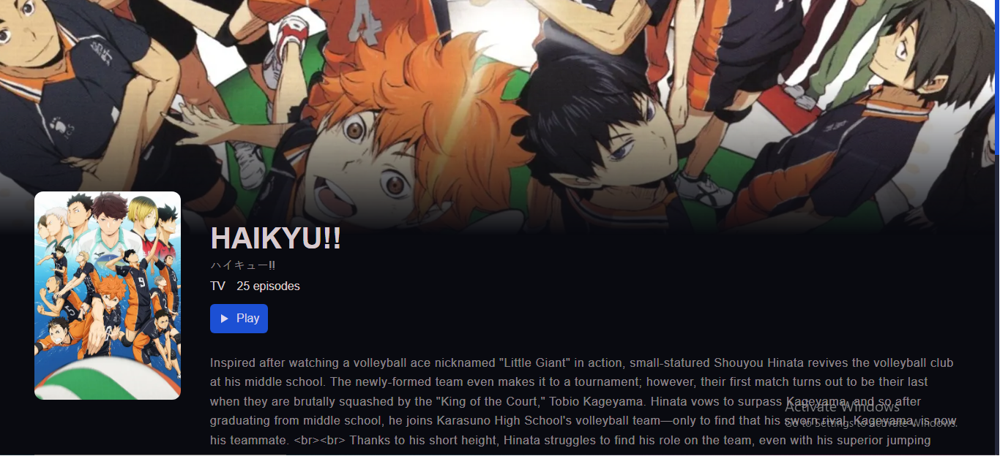
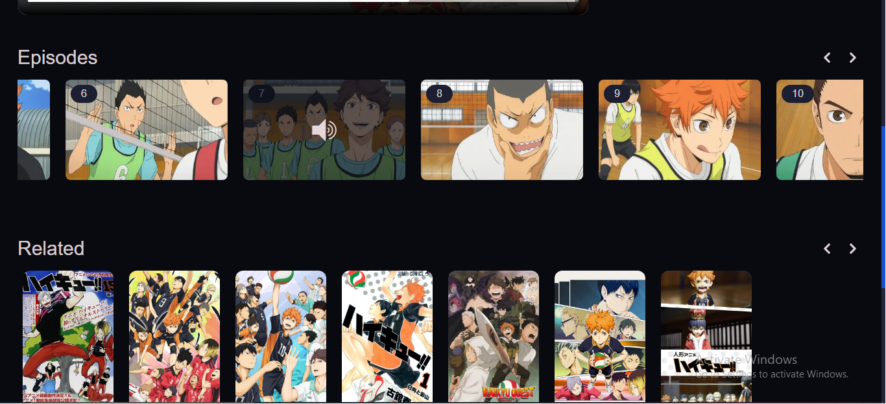
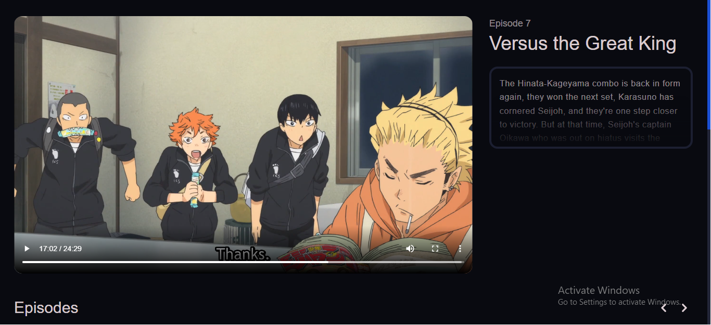

<p align="center">
  <a href="https://github.com/riimuru/gogoanime">
    
  </a>

  <h2 align="center">Anime Time !!!</h2>
</p>

---

A streaming platform that helps you search & watch your favorite anime with an awesome & responsive UI and above all, **Ad free**.

---

# Acknowledgements

The api used for fetching anime data is [consumet-api](https://www.github.com/consumet/consumet-api). It also provides data for scraping video sources from gogoanime.

Also, thanks to the following open source libraries

-   [NextJS](https://nextjs.org/)
-   [TailwindCSS](https://tailwindcss.com/)

---

# Preview

Following are the screenshots of the project:

-   
-   
-   
-   

---

# Deploy locally

Before following the steps, please ensure you have node and git installed on your pc.

-   Firstly, download the repository using the command

```
git clone https://github.com/rachmaninoff8267/animflix.git
```

-   Next, to download the dependencies, run:

```
npm install
```

-   Finally, run the site (in development mode) using

```
npm run dev
```

-   For production, use

```
npm run build
```

The app will run on [http://localhost:3000](http://localhost:3000)
